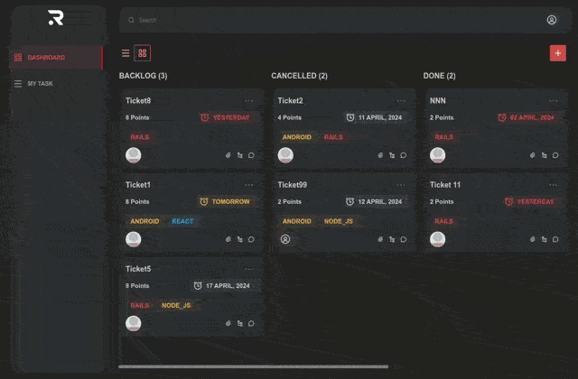

# Ravn-Challenge

## How to run it?
1. Clone repository
    > `git clone https://github.com/aatari88/ravn-challenge.git`
2. Go directory
    > `cd ravn-challenge`
3. Install dependencies
    > `yarn install`
4. Start project
    > `yarn dev`

## Project description

This project is to create tasks, which can be placed in the following columns: BACKLOG, CANCELLED, DONE, IN_PROGRESS, TODO. These tasks can be modified and deleted. 

I recently discovered Mantine as a replacement for Material UI, due to cost issues. That's why I decided to use it in this project.

At first I decided not to use React Context, but when I implemented the animation for the new tasks it became more practical for me to use it.

## Technologies/libraries
* React
* Apollo Client
* Mantine
* Remix Icon
* Animate.css